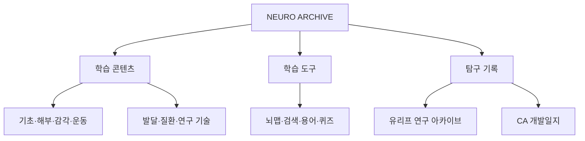

# NEURO ARCHIVE 장기 개발 계획

- 문서 상태: 체크포인트 초안
- 작성일: 2026-09-10
- 적용 범위: 1학기 CA 프로젝트 전용
- 구현 상태: **최종 계획 승인 전 구현 금지**

## 1. 프로젝트 목적과 경계

NEURO ARCHIVE는 뇌의 구조·세포·신호 전달·감각·인지·운동·발달·질환·연구 기술을 체계적으로 학습하고, 배운 개념을 실제 유리프 AR·EEG 탐구에 적용한 과정을 함께 기록하는 웹 기반 뇌과학 학습·탐구 아카이브다.

사이트는 다음 세 축으로 구분한다.

1. **학습 콘텐츠**: 뇌과학 지식을 구조화해 읽고 연결한다.
2. **학습 도구**: 뇌맵·검색·용어·퀴즈로 탐색과 복습을 돕는다.
3. **탐구 기록**: 유리프 연구와 CA 사이트 개발 과정을 사실 기반으로 남긴다.

중요한 프로젝트 경계:

- 이 저장소는 1학기 CA `NEURO ARCHIVE`만 다룬다.
- 2학기 CA `EcoEvo Observatory`의 코드·문서·데이터·디자인을 섞지 않는다.
- 유리프는 사이트의 중심 주제가 아니라 뇌과학 지식의 실제 적용 사례다.
- 의료 진단 사이트가 아니다. 질환 페이지는 교육용 주의문을 표시한다.
- 블로그식 게시물 수 경쟁보다 개념 간 연결과 탐구 과정의 진실성을 우선한다.

## 2. 정보 구조



### 2.1 학습 콘텐츠 축

| 순서 | 영역 | 핵심 질문 | canonical path |
|---:|---|---|---|
| 1 | 기초 신경과학 | 뉴런은 신호를 어떻게 만들고 연결하는가? | `basic-neuroscience.html` |
| 2 | 신경해부학 | 구조와 경로는 어디에 있고 어떻게 이어지는가? | `neuroanatomy.html` |
| 3 | 감각·인지 | 자극은 어떻게 지각·기억·판단이 되는가? | `sensory-cognition.html` |
| 4 | 운동·행동 | 목표와 몸의 상태는 어떻게 행동을 만드는가? | `movement-behavior.html` |
| 5 | 뇌 발달 | 신경관에서 성인·노화 뇌까지 무엇이 변하는가? | `brain-development.html` |
| 6 | 뇌질환 | 세포·회로·혈류 변화는 기능과 어떻게 연결되는가? | `brain-disorders.html` |
| 7 | 연구·기술 | 뇌를 무엇으로 측정·모델링·조절하는가? | `research-tech.html` |

### 2.2 학습 도구 축

| 도구 | 역할 | canonical path / data |
|---|---|---|
| 홈 검색 | 한글·영문·별칭·질환·기술에서 해당 섹션으로 이동 | `index.html`, `data/search-index.json` |
| 인터랙티브 뇌맵 | 겉면 5개 영역의 위치·설명·상세 페이지 연결 | `brainmap.html` |
| 영역 상세 | 위치·하위영역·연결·기능 변화·질환·오해·심화 | `frontal.html` 등 5개 |
| 핵심 용어 | 각 페이지 용어 목록과 검색 별칭 | 각 학습 페이지, 검색 색인 |
| 퀴즈 | 객관식·참거짓·경로 순서·오답 복습 | `quiz.html`, `data/quiz-questions.json` |

### 2.3 탐구 기록 축

| 기록 | 역할 | canonical path / data |
|---|---|---|
| 탐구 아카이브 | 공개 가능한 유리프·CA 기록 열람 | `research-archive.html`, `data/research-records.json` |
| 로컬 편집기 | 서버 없이 초안 작성·수정·백업·복사 | `record-editor.html` |
| 유리프 연구 구조 | 배경에서 결론까지 단계별 기록 | `research-archive.html` 내부 섹션 |
| CA 개발일지 | 사이트 설계·구현·검증·배포 과정 | 공개 기록의 `type: ca` |

## 3. canonical 파일 구조

### 3.1 HTML

```text
index.html
brainmap.html
basic-neuroscience.html
neuroanatomy.html
sensory-cognition.html
movement-behavior.html
brain-development.html
brain-disorders.html
research-tech.html
research-archive.html
record-editor.html
quiz.html
references.html
frontal.html
parietal.html
temporal.html
occipital.html
cerebellum.html
```

기존에 사용된 다음 주소는 외부 링크 호환이 필요한 경우 짧은 redirect 문서만 둔다. 본문을 중복 작성하지 않는다.

- `cognition.html` → `sensory-cognition.html`
- `behavior.html` → `movement-behavior.html`
- `development.html` → `brain-development.html`
- `disease.html` → `brain-disorders.html`
- `research.html` → `research-tech.html`

### 3.2 공통 자산

```text
assets/css/base.css
assets/css/layout.css
assets/css/components.css
assets/css/content.css
assets/css/brainmap.css

assets/js/site.js
assets/js/search.js
assets/js/brainmap.js
assets/js/quiz.js
assets/js/research-records.js
assets/js/record-editor.js

data/search-index.json
data/quiz-questions.json
data/research-records.json
data/references.json
```

기술 스택은 빌드 과정이 없는 순수 HTML·CSS·JavaScript를 유지한다. 개발 편의를 위한 생성 스크립트를 쓰더라도 최종 배포물은 빌드 없이 GitHub Pages에서 바로 동작해야 한다.

## 4. 공통 페이지 설계

모든 주요 학습 페이지는 다음 순서를 기본 템플릿으로 사용한다.

1. 한글·영문 제목
2. 한 문장 핵심
3. 학습 목표
4. 선수 개념
5. 페이지 목차와 anchor
6. `핵심` 설명
7. `자세히` 설명
8. 과정·경로 도식
9. 비교표
10. 핵심 정리
11. 흔한 오해
12. `올림피아드 심화`
13. 핵심 용어
14. 최소 3문항 자가점검
15. 관련 페이지
16. 이전·다음 이동
17. 참고 자료

작성 원칙:

- 한 뇌 부위와 복잡한 기능을 일대일로 대응하지 않는다.
- 핵심 문장은 짧게, 정확한 조건과 예외는 `자세히`에서 설명한다.
- 시험용 단순화가 필요하면 `시험에서 자주 쓰는 표현`과 `정확한 설명`을 구분한다.
- 표는 모바일에서 가로 스크롤할 수 있게 한다.
- 자체 SVG·CSS 도식은 구조와 관계를 설명할 때만 사용한다.
- PDF 문장·그림·기출문제를 복제하지 않는다.

## 5. 학습 페이지 세부 범위

### 5.1 기초 신경과학

기존 `basic-neuroscience.html`은 상당한 본문이 있으므로 먼저 백업·비교하고 내용을 보존한 상태에서 단계적으로 공통 스타일을 분리한다.

필수 범위:

- 신경과학의 분자·세포·시스템·행동·인지 수준
- CNS와 PNS
- 감각·사이·운동뉴런, 뉴런 구조
- 별세포·희소돌기아교세포·슈반세포·미세아교세포·뇌실막세포
- 휴지막전위와 전기화학적 구동력
- 네른스트·골드만 방정식
- EPSP·IPSP와 시간적·공간적 합산
- 활동전위, 절대·상대불응기
- 수초와 도약전도
- 전기·화학 시냅스
- 전달물질·이온성/대사성 수용체
- rate·temporal·sparse·population coding
- 회로, 시냅스 가소성, LTP·LTD

과학 검수 포인트:

- `1000억 뉴런`, `교세포 10배`를 확정 사실처럼 쓰지 않는다.
- 전달물질의 효과는 수용체·역전전위·세포 상태에 따라 달라짐을 설명한다.
- LTP/LTD를 기억 전체와 같은 말로 사용하지 않는다.

### 5.2 신경해부학

- 방향 용어와 관상·시상·수평 절단면
- 회백질·백질·핵·신경절·로·신경
- CNS·PNS
- 경막·거미막·연막, 뇌실·CSF
- 대뇌피질·대뇌엽·주요 고랑과 이랑
- 운동·감각 호문쿨루스
- 뇌량과 반구 연결
- 기저핵
- 해마·편도체와 변연계 개념의 한계
- 시상·시상하부·뇌하수체
- 중뇌·교뇌·연수
- 소뇌
- 척수, 피질척수로, 척수시상로, 뒤기둥-안쪽섬유띠
- 피부절과 반사
- 뇌혈관과 윌리스고리
- I~XII 뇌신경

### 5.3 감각·인지

- 감각과 지각
- 감각변환, 수용장, 적합자극, 적응
- 체성감각과 통증
- 눈·망막·광변환·시각경로·V1·배측/복측 경로
- 달팽이관·털세포·청각경로
- 반고리관·이석기관·전정안반사
- 미각과 후각
- 학습·기억, 주의, 작업기억
- 언어, 사고·계획·의사결정
- 감정과 보상

검수 포인트:

- 감각기관을 카메라·녹음기처럼 설명하지 않는다.
- 좌뇌·우뇌 성격론을 사용하지 않는다.
- 해마=기억창고, 편도체=공포센터, 도파민=쾌락처럼 환원하지 않는다.

### 5.4 운동·행동

- 운동조절의 계층
- 운동피질과 피질척수로
- 알파운동뉴런과 운동단위
- 근방추·골지힘줄기관
- 신장반사와 척수 회로
- 중추패턴발생기
- 기저핵의 행동 선택
- 소뇌의 예측·오차 수정
- 운동학습
- 자율신경계
- 시상하부와 항상성
- 급성·지속 스트레스 반응
- 생체주기, SCN
- REM·NREM 수면과 기억

### 5.5 뇌 발달

- 외배엽·중배엽·내배엽과 신경외배엽
- 신경판·신경주름·신경관·신경능선
- 일차·이차 뇌소포
- 뇌실과 성인 뇌 구조의 발생
- 신경전구세포 증식과 운명 결정
- 방사·접선 이동
- 성장원뿔과 축삭유도
- 시냅스 형성, 세포사멸, 가지치기, 수초화
- 결정적 시기와 민감기
- 영아·아동·청소년기 변화
- 성인 가소성
- 정상 노화
- 대표적 신경관 결손

표현 원칙:

- 청소년 뇌를 미완성·열등하다고 단정하지 않는다.
- 정상 노화를 신경퇴행성 질환과 같은 것으로 쓰지 않는다.
- 유전자와 경험을 양자택일로 설명하지 않는다.

### 5.6 뇌질환

상단에 다음 문구를 그대로 표시한다.

> 이 페이지는 신경과학 학습을 위한 교육 자료이며 개인의 증상을 진단하거나 치료를 결정하기 위한 자료가 아닙니다.

필수 범위:

- 증상의 시간 경과·분포와 병변 위치 추론
- EEG·CT·MRI·DTI·PET·CSF 등 검사 원리
- 뇌졸중, 뇌전증, 외상
- 감염·염증, 다발성경화증
- 치매 증후군과 알츠하이머병의 구분
- 파킨슨병, ALS, 헌팅턴병
- 뇌종양
- 불안·강박·우울·양극성·조현병·중독
- 약물·수술·재활·뇌자극 치료 원리

표현 원칙:

- 자가진단식 체크리스트를 만들지 않는다.
- 확정적 예후와 오래된 유병률을 쓰지 않는다.
- 정신건강 질환을 의지·인격·폭력성과 연결하지 않는다.
- 뇌영상의 집단 평균 차이를 개인 진단 도구처럼 설명하지 않는다.

### 5.7 연구·기술

- 분자·세포·시스템·행동·인지·계산신경과학
- 세포내 기록, 단일세포 기록, LFP
- EEG, MEG
- CT, MRI, DTI, fMRI, PET, NIRS
- TMS, tDCS, tACS, DBS, 미주신경자극, 집속초음파
- BCI와 신경보철
- 신경부호화와 population decoding
- 생물학적 신경망과 인공신경망의 차이
- 신경윤리

기술별 표 항목:

1. 무엇을 측정하거나 조절하는가
2. 직접 신호인가 간접 신호인가
3. 시간해상도
4. 공간해상도 또는 표적 범위
5. 침습성
6. 장점
7. 한계와 대표적 혼란변수

## 6. 인터랙티브 뇌맵과 상세 페이지

`brainmap.html`은 삭제하지 않는다. 현재 홈의 `brain.png`가 이 페이지로 연결되며, 실제 인터랙션은 별도 페이지에 있다.

확정 동작:

- 영역 hover 시 `translate`, `scale`, `rotate`를 사용하지 않는다.
- 밝기, 외곽선, 그림자만 바꾼다.
- tooltip은 항상 수평이다.
- tooltip 위치를 viewport 안으로 제한한다.
- 영문명과 한글명을 굵게, 두 줄로 표시한다.
- 소뇌의 마지막 확정 방향·형태를 보존한다.
- 소뇌 외곽의 투명 사각형이 드러나지 않게 한다.
- 의미 있는 `a` 또는 `button`을 사용한다.
- `Tab`, `Enter`, `Space`, 모바일 터치를 지원한다.
- 모바일에서는 tooltip 대신 고정 설명 패널을 제공한다.

상세 페이지:

- `frontal.html`
- `parietal.html`
- `temporal.html`
- `occipital.html`
- `cerebellum.html`

각 페이지의 공통 항목:

1. 위치
2. 하위영역
3. 기능
4. 주요 입력·출력 연결
5. 손상 시 가능한 기능 변화
6. 관련 질환과 회로
7. 흔한 오해
8. 심화 개념
9. 핵심 용어
10. 자가점검
11. 참고 자료

## 7. 홈 페이지 계획

기존 남색·파란색 디자인과 카드 분위기를 보존한다.

수정 항목:

- `60+ 뇌 구조`, `120+ 연구 노트`, `25+ 학습 루트`처럼 검증되지 않은 수치를 제거한다.
- 수치가 필요하면 실제 JSON·DOM 데이터에서 계산한다.
- 좋아요·댓글을 제거한다.
- 완료되지 않은 EEG 분석을 완료된 연구처럼 표시하지 않는다.
- 최근 탐구 3개는 `data/research-records.json`의 `public` 기록만 읽는다.
- 검색처럼 보이는 `div`를 실제 `input type="search"`로 바꾼다.
- 뇌맵·기초학습·탐구기록 CTA를 실제 페이지로 연결한다.
- 추천 학습 루트와 오늘의 개념은 존재하는 anchor만 가리킨다.
- 버튼·링크의 hover, focus, disabled 상태를 구분한다.

## 8. 상단 내비게이션

메뉴 순서:

1. Home
2. 기초 신경과학
3. 신경해부학
4. 감각·인지
5. 운동·행동
6. 뇌 발달
7. 뇌질환
8. 연구·기술
9. 탐구 기록
10. Quiz

뇌맵은 홈 핵심 CTA와 신경해부학 페이지에서 접근한다.

요구 동작:

- 현재 페이지는 파란 밑줄과 `aria-current="page"`로 표시한다.
- hover는 파란 글씨, focus는 충분히 선명한 outline을 사용한다.
- 모바일은 햄버거 버튼으로 전체 메뉴를 열고 닫는다.
- `Escape`, 외부 클릭, 메뉴 선택으로 닫을 수 있게 한다.
- 모든 메뉴 목적 파일이 실제로 존재해야 한다.

## 9. 검색 계획

검색 대상:

- 페이지명
- 한글·영문 용어
- 별칭과 약어
- 섹션 제목
- 관련 질환
- 연구 기술

검색 색인 항목:

```json
{
  "title": "막전위와 활동전위",
  "category": "기초 신경과학",
  "summary": "이온 농도차와 채널이 빠른 신경 신호를 만드는 과정",
  "url": "basic-neuroscience.html#signal",
  "aliases": ["membrane potential", "action potential"],
  "keywords": ["탈분극", "재분극", "불응기", "도약전도"]
}
```

필수 상태:

- 초기 상태: 검색 사용법 제시
- 입력 중: 결과 수와 최대 표시 개수 안내
- 결과 없음: 다른 한글·영문명 제안
- 데이터 로드 실패: HTTP 서버 필요 여부와 오류 표시
- 결과 선택: 실제 page+anchor로 이동

## 10. 퀴즈 계획

초기 목표는 독창적인 40~50문항이다.

기능:

- 단원 선택
- 난이도 선택: 핵심·자세히·올림피아드 심화
- 문제와 선택지 무작위화
- 객관식·참거짓·경로 순서 문제
- 즉시 피드백
- 정답 해설
- 선택한 오답이 틀린 이유
- 관련 개념 anchor 링크
- 결과 화면
- 오답 다시 풀기
- `localStorage` 진도
- 초기화 전 확인

문항 검수:

- PDF 문제 문장을 복제하지 않는다.
- 보기 중 두 개가 동시에 정답이 되지 않는지 확인한다.
- 정답·해설·오답 이유가 모순되지 않는지 자동 검사한다.
- 페이지 anchor가 실제 존재하는지 링크 검사에 포함한다.

## 11. 유리프 연구 아카이브

연구명:

> EEG 기반 인지 반응 및 작업 수행 분석을 통한 개인 맞춤형 AR 작업보조 HUD 배치 알고리즘 설계

유리프 기록은 다음 순서를 독립적인 아카이브 구조로 사용한다.


### 11.1 탐구 배경

- AR HUD 위치가 중앙 과제와 주변 탐색 수행에 미치는 영향
- 집단 평균 하나보다 개인별 배치 프로필이 필요한 이유
- 행동 자료와 EEG를 함께 보는 이유와 한계
- 탐색적 지표를 확증 결과처럼 쓰지 않는 원칙

### 11.2 연구 설계

위치 조건:

- `CENTER`
- `N-L`
- `N-R`
- `N-T`
- `N-B`
- `N-BR`

과제·시간:

- 중앙 `SAME/DIFF`
- 주변 AR 화살표 방향 응답
- Fixation 1.0초
- 자극 3.0초
- 중앙 응답 제한 1.2초
- AR 응답 제한 1.2초
- ITI 0.6~1.0초
- 6개 위치 × 8회 = 48 trials
- 위치·화살표·정답 균형 무작위화

Calibration:

- Eyes open 30초
- Eyes closed 30초
- 0-back 60초
- 휴식 30초
- 2-back 60초

### 11.3 실험 기록

매 세션 기록 항목:

- 익명 참가자 ID
- 동의·안전 절차 완료 여부
- 장비·전극·샘플링 설정
- 자극 버전과 무작위화 seed
- 시작·종료 시각
- 중단·재시작·제외 사건
- 데이터 파일의 비공개 보관 위치를 가리키는 안전한 참조
- 공개 가능한 관찰과 다음 조치

이름·연락처·동의서·민감한 EEG 원자료는 공개 저장소에 넣지 않는다.

### 11.4 데이터

- trial별 위치·화살표·정답·응답·정확도·반응시간
- EEG event marker와 행동 로그 정합성
- 결측·오답·시간초과·artifact 표시
- raw, preprocessed, derived data의 구분
- 공개 저장소에는 원자료 대신 스키마·익명 집계·재현 절차만 공개하는 방향을 우선 검토

실제 결과가 없으므로 결과 칸은 다음 형식만 사용한다.

```text
[실험 후 작성: accuracy_by_position]
[실험 후 작성: reaction_time_by_position]
[실험 후 작성: workload_by_position]
```

### 11.5 분석

- MNE-Python
- Welch PSD
- Theta·Alpha·Beta
- 정확도와 반응시간
- 탐색적 workload

```text
W = log(theta_frontal) - log(alpha_posterior)
```

이 W는 확정적인 인지부하 측정값이 아니라 특정 전극군·전처리·시간창 정의에 의존하는 탐색적 지표로 표시한다.

보상과 알고리즘:

```text
R = A_p × A_c × (1 - NC)
UCB_j = 평균 보상_j + sqrt(2 ln t / n_j)
```

- Center 고정, Random, UCB 비교
- 동일 기록을 사용하는 offline replay
- 정규화 방식, 0으로 나누기, 초기 탐색, 결측 처리 규칙을 사전 지정

통계:

- 소표본 반복측정
- Friedman
- 사전 지정 paired Wilcoxon
- 효과크기
- 다중비교 처리
- 집단 결과와 개인별 프로필

### 11.6 결론

- 결과를 얻기 전에는 비워 둔다.
- 예상과 다른 결과도 기록한다.
- 통계적 차이와 실제 사용 가치, 알고리즘 보상, 사용자 경험을 구분한다.
- 연구의 한계, 대안 설명, 다음 실험을 포함한다.

### 11.7 초기 기록 후보

| 날짜 | 후보 기록 | 상태 표기 원칙 |
|---|---|---|
| 2026-04-29 | 초기 주제 확정 | 실제 확정 내용만 기록 |
| 2026-06-01 | 위치 효과와 설계 한계 재검토 | 검토 내용과 결정 구분 |
| 2026-08-28 | 최종 연구계획 확정 | 설계 완료, 실험 완료 아님 |
| 2026-09-04 | EEG 장비 대여 문의 준비 | 계획·준비 상태로 표시 |

후보 문구만으로 세부 수행을 만들어 내지 않는다. 다음 세션에서 사용자가 보유한 실제 기록과 대조한 뒤 공개 JSON을 작성한다.

## 12. CA 사이트 개발일지

기록 항목:

- 날짜
- 제목
- 단계와 상태
- 목표
- 실제 수행 내용
- 변경 사항과 이유
- 어려웠던 점
- 해결 과정
- 결정 사항
- 검증 증거 링크
- 다음 목표
- 참고 자료
- 공개 여부

좋은 개발일지는 ‘완료했다’보다 무엇을 확인했고 어떤 근거로 무엇을 바꿨는지 보여 줘야 한다. 계획은 계획, 구현은 구현, 테스트는 테스트 결과로 구분한다.

## 13. 로컬 기록 편집기

GitHub Pages는 정적이므로 브라우저가 저장소에 직접 쓴다고 표현하지 않는다.

필수 안내:

- 임시저장은 현재 브라우저에만 보관된다.
- 공개하려면 JSON을 검토한 뒤 저장소에 반영해야 한다.
- 브라우저 데이터 삭제에 대비해 내보내기가 필요하다.

필수 기능:

- 기록 종류 선택
- 모든 개발일지·연구일지 필드 입력
- 미리보기
- `localStorage` 저장·수정
- 삭제 전 확인
- JSON 내보내기·가져오기
- 잘못된 JSON과 스키마 오류 표시
- 유리프 기록용 텍스트 복사
- CA 제출용 텍스트 복사
- 공개 후보와 비공개 로컬 초안 구분

보안 원칙:

- 모든 화면 출력은 escape 또는 `textContent`를 사용한다.
- `http`·`https` 이외 위험한 링크 스킴을 차단한다.
- import가 같은 ID를 덮을 때 확인한다.
- 민감정보를 적지 말라는 경고를 폼 위에 표시한다.

## 14. 데이터 구조 초안

### 14.1 공개 연구 기록

```json
{
  "id": "stable-record-id",
  "type": "urif",
  "date": "YYYY-MM-DD",
  "stage": "연구 설계",
  "status": "계획",
  "title": "제목",
  "goal": "목표",
  "work": "실제 수행",
  "changes": "변경 사항과 이유",
  "difficulty": "어려웠던 점",
  "solution": "해결 과정",
  "decision": "결정 사항",
  "evidence": [],
  "next": "다음 목표",
  "references": [],
  "visibility": "public"
}
```

홈 최근 탐구 카드는 `visibility === "public"`인 기록을 날짜 내림차순으로 정렬해 3개만 표시한다.

### 14.2 퀴즈 문항

```json
{
  "id": "basic-01",
  "unit": "basic",
  "difficulty": "core",
  "type": "mcq",
  "prompt": "새로 작성한 문제",
  "options": ["보기 A", "보기 B", "보기 C", "보기 D"],
  "answer": 1,
  "explanation": "정답 해설",
  "wrong": ["오답 이유 A", "", "오답 이유 C", "오답 이유 D"],
  "link": "basic-neuroscience.html#signal"
}
```

## 15. 접근성·반응형

필수 구현:

- semantic `header`, `nav`, `main`, `section`, `footer`
- 페이지별 `h1` 하나, `h2`·`h3` 순서 점검
- 본문 건너뛰기 링크
- 모든 상호작용의 키보드 접근
- 충분히 선명한 `:focus-visible`
- 의미 있는 이미지 alt
- 장식 이미지는 빈 alt 또는 CSS 배경 처리
- 모바일 햄버거와 터치 대체 설명
- 표의 가로 스크롤
- 이미지 최대 너비 100%
- 콘텐츠 가로 넘침 방지
- `prefers-reduced-motion`
- 색에만 의존하지 않는 상태 표시
- 오류·결과 메시지의 `aria-live`

검사 너비:

- 360px
- 768px
- 1024px
- 1440px

## 16. 구현 단계와 체크포인트

최종 계획이 사용자에게 승인된 뒤에만 아래 구현을 시작한다.

### 단계 0. 최종 계획 승인

- 8개 PDF 분석의 미확인 범위를 보완한다.
- 계획 문서에서 빠진 요구사항을 대조한다.
- 사용자에게 구조·우선순위·공개 기록 후보를 검토받는다.
- 승인 전에는 HTML/CSS/JS를 수정하지 않는다.

체크포인트 커밋 예:

```text
docs: finalize neuro archive implementation plan
```

### 단계 1. 저장소 기준선과 공통 구조

- 최신 `main` 재확인
- 기존 페이지 데스크톱·모바일 화면 기록
- 링크·콘솔·접근성 기준선 보고서
- 공통 CSS·JS를 단계적으로 분리
- 내비게이션 canonical path 통일
- 기존 `basic-neuroscience.html` 본문 보존 확인

커밋 예:

```text
refactor: unify navigation and shared styles
```

### 단계 2. 홈과 뇌맵

- 홈 가짜 수치·반응 수치 제거
- 실제 검색 입력 구조
- 공개 기록 기반 최근 탐구
- 뇌맵 움직임 제거
- 키보드·터치·tooltip 경계 처리
- 5개 상세 페이지 골격

커밋 예:

```text
fix: stabilize brain map interactions
```

### 단계 3. 학습 콘텐츠

- 기존 기초 페이지 과학 검수·보강
- 나머지 6개 학습 페이지 작성
- 5개 영역 상세 페이지 작성
- 참고 자료와 페이지 간 연결
- PDF와 최신 근거 대조표 갱신

커밋 예:

```text
feat: add neuroscience learning sections
```

### 단계 4. 연구 기록

- 유리프 배경·설계·실험·데이터·분석·결론 구조
- 공개 기록 JSON
- CA 개발일지
- 로컬 편집기·JSON import/export·텍스트 복사
- 개인정보·오류 처리 테스트

커밋 예:

```text
feat: add research archive and local editor
```

### 단계 5. 검색과 퀴즈

- 검색 색인과 결과 UI
- 독창적 40~50문항
- 채점·해설·오답·관련 링크
- 진도·복원·초기화

커밋 예:

```text
feat: add quiz and search
```

### 단계 6. 검수와 문서

- 링크·anchor·asset·JSON 자동 검사
- 브라우저 기능·콘솔 검사
- 4개 viewport 시각 검사
- 사실성·저작권·개인정보 문구 검토
- README·references·planning 체크포인트 갱신

커밋 예:

```text
docs: document sources and project workflow
fix: resolve responsive and accessibility issues
```

### 단계 7. 배포

- 모든 테스트 통과
- 최신 원격 `main`과 fast-forward 가능 여부 확인
- 정상 push, force push 금지
- Pages workflow/배포 상태 확인
- 공개 URL에서 핵심 기능 재검사
- `WORK_RESUME.md`에 배포 SHA·남은 한계 기록

## 17. 테스트 계획

### 17.1 정적 검사

1. 필요한 HTML 파일 존재
2. 내부 href·src 대상 존재
3. 모든 hash anchor 존재
4. CSS·JS·JSON 파싱
5. 퀴즈 ID·정답 인덱스·해설·오답 이유 검증
6. 연구기록 필수 필드와 날짜·공개 상태 검증
7. PDF 원본이 추적되지 않는지 검사
8. EcoEvo 문자열·파일이 들어오지 않았는지 검사

### 17.2 브라우저 검사

1. 각 주요 페이지 로드와 치명적 콘솔 오류 0개
2. 메뉴 active 상태
3. 모바일 메뉴 열기·닫기·키보드
4. 검색 초기·결과·없음·이동
5. 뇌맵 hover·focus·Enter·Space·touch
6. tooltip 수평·viewport 경계·모바일 대체 패널
7. 퀴즈 세 유형의 채점·해설·다음·결과
8. 오답 재도전·새로고침 후 진도 복구·초기화
9. 기록 저장·수정·삭제 확인
10. JSON export/import와 잘못된 JSON 오류
11. 두 종류의 복사 텍스트
12. 새로고침 뒤 localStorage 복구
13. 360·768·1024·1440px overflow와 가독성

### 17.3 배포 검사

1. `https://ggy5555.github.io/` 응답
2. canonical page 18개와 호환 redirect 응답
3. asset·JSON의 대소문자 경로
4. Pages workflow가 대상 commit SHA로 성공
5. 공개 URL에서 홈 검색, 뇌맵, 퀴즈, 기록 편집기 smoke test

완료 기준:

- 존재하지 않는 내부 링크 0개
- 치명적 콘솔 오류 0개
- 가짜 통계·연구 결과·좋아요·댓글 0개
- 모바일에서 핵심 기능 사용 가능
- GitHub Pages 공개 URL 정상 작동

## 18. 위험과 대응

| 위험 | 대응 |
|---|---|
| 기존 기초 페이지 본문 손실 | diff로 섹션별 보존 여부 확인, 단계적 리팩터링 |
| 파일명 혼용으로 404 | canonical 목록 자동 검사, 필요한 redirect만 유지 |
| PDF 저작권 침해 | 원본 미커밋, 새 문장·문항·도식, 출처·사용 영역 표시 |
| 오래된 수치·통념 | 숫자를 기본적으로 생략하고 공식/1차 자료 검증 뒤 사용 |
| 가짜 유리프 결과 | 결과 필드는 placeholder, 상태를 실험 전으로 표시 |
| localStorage를 서버 저장으로 오해 | 편집기 상단·내보내기 영역에 반복 안내 |
| 참가자 재식별 | 원자료·이름·연락처 미공개, 익명 ID와 최소 집계 |
| 모바일 메뉴·뇌맵 접근 불가 | 키보드·터치 대체 흐름과 360px 실제 검사 |
| 대규모 작업 중 세션 중단 | 큰 단계마다 `planning/` 문서 갱신·체크포인트 커밋 |

## 19. 현재 결론

이 문서는 구현을 승인하는 최종 명세가 아니라 분석 보존용 체크포인트다. 다음 작업은 PDF 분석의 미확인 부분을 필요한 범위에서 보완하고, 이 계획이 원 요청을 빠짐없이 반영했는지 문서 수준에서 검토하는 것이다. **사용자가 최종 계획을 확인하기 전에는 사이트 HTML·CSS·JavaScript 구현을 시작하지 않는다.**
